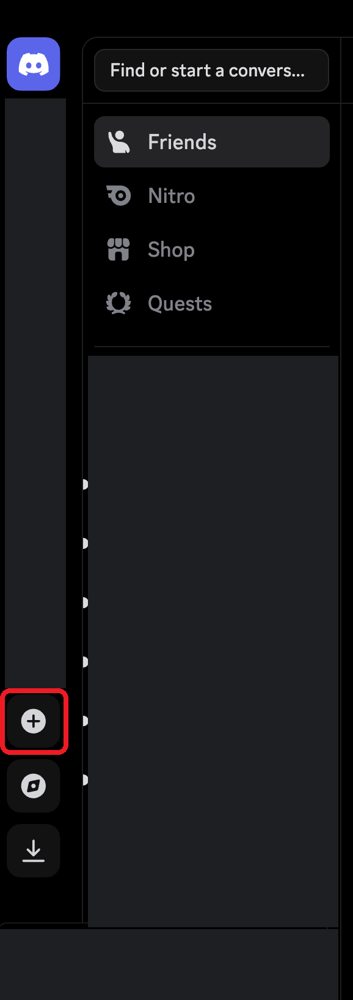
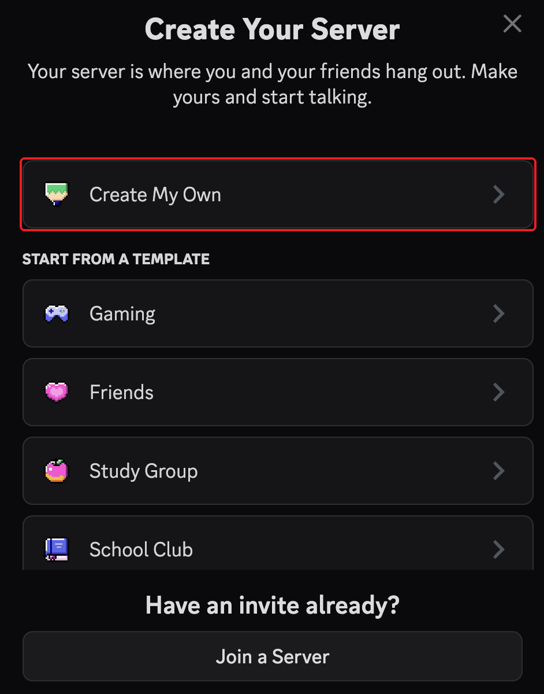
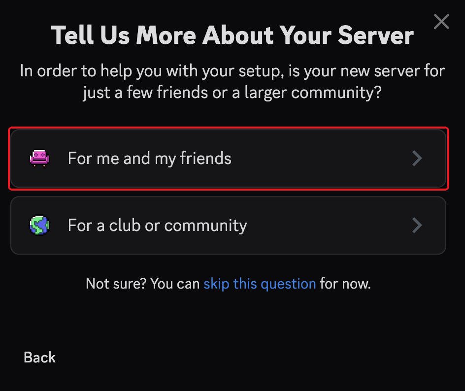
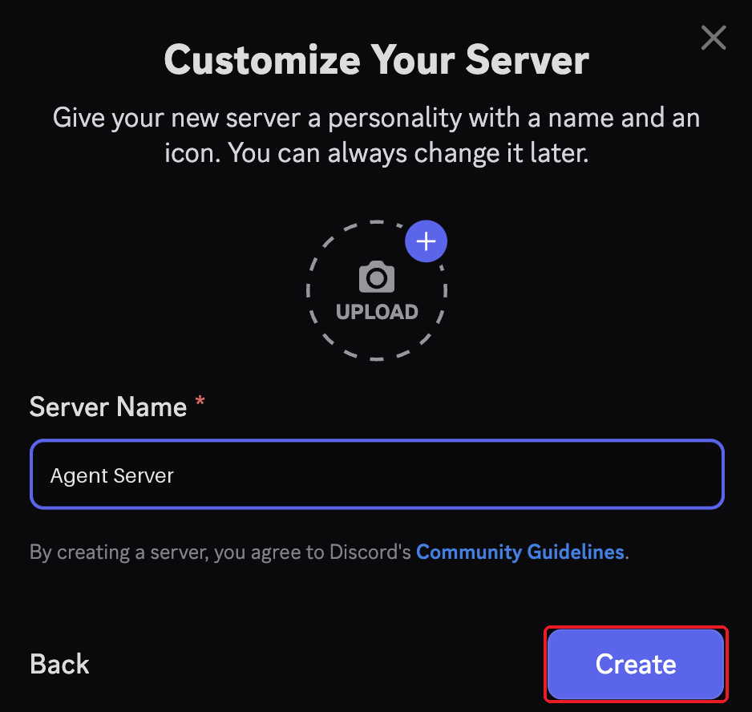

# discord-agent-kit

Talk to your AI coding agent (**Claude Code** or **Codex**) from Discord.

```
you, in Discord ──@mention──▶ bot ──▶ agent running on your machine
                ◀──── reply ─────────┘
```

Why Discord?

- **One place for all agents.** You don't have to open terminals and switch between sessions. Just message the agent.
- **A log you can search.** Every conversation stays in Discord. Weeks later you can search "where did I save that result?", open the thread, and ask the agent again.
- **Works from your phone.**

## Setup (about 15 minutes)

| Step | What | Screenshots |
|---|---|---|
| 0 | [Make a Discord server](#step-0-make-a-discord-server), if you don't have one | ✅ |
| 1 | [Create a bot](#step-1-create-a-discord-bot) and add it to your server (one bot per agent) | ✅ |
| 2 | [Get the bot token](#step-2-get-the-bot-token) and your user ID | ✅ |
| 3 | Connect an agent: **[Claude Code](docs/3_claude.md)** or **[Codex](docs/4_codex.md)** | |

## Step 0: Make a Discord server

Your agents need a server to live in. A private server just for you and your agents works well. Skip this step if you already have one.

### 1. Click "Add a Server"

In the Discord app, click the **+** button in the left sidebar.



### 2. Click "Create My Own"



### 3. Click "For me and my friends"



### 4. Name it and click Create

Give it any name, e.g. `Agent Server`, and click **Create**.



## Step 1: Create a Discord bot

Each agent logs in to Discord as a bot. Make one bot per agent.

### 1. Create a new application

Go to <https://discord.com/developers/applications> and click **New Application**.


### 2. Name it and click Create

Give it a name (e.g. `my-codex`), tick the agreement box, and click **Create**.


### 3. Solve the captcha


### 4. Open the Installation tab

You land on the app's settings page. Click **Installation** in the left sidebar.


### 5. Set Install Link to "None"

Under **Install Link**, change the dropdown from *Discord Provided Link* to **None**, then click **Save Changes**. You need this before step 6 will let you turn off *Public Bot*.

Then click **Bot** in the left sidebar.


### 6. Turn off Public Bot

On the Bot page, scroll down and turn **Public Bot** off. Then only you can add this bot to a server.


### 7. Turn on all three intents

Scroll to **Privileged Gateway Intents** and turn on all three: **Presence**, **Server Members** and **Message Content**. Without *Message Content Intent*, the bot sees every message as empty.


### 8. Tick Administrator and save

Scroll to **Bot Permissions**, tick **Administrator**, and click **Save Changes**. Then click **OAuth2** in the left sidebar.


### 9. Scroll down on the OAuth2 page


### 10. Tick the `bot` scope

Under **OAuth2 URL Generator → Scopes**, tick **bot**, then scroll down.


### 11. Tick Administrator again

Under **Bot Permissions** (on the OAuth2 page this time), tick **Administrator**, then scroll down.


### 12. Copy the generated URL

Make sure **Integration Type** is **Guild Install**. Copy the **Generated URL** and open it in a new browser tab.


### 13. Choose your server

Pick your server under **Add to server** and click **Continue**.


### 14. Authorize

Leave **Administrator** ticked and click **Authorize**.


### 15. Solve the captcha


### 16. Done

The bot is now in your server. It shows as offline until you start the agent.


## Step 2: Get the bot token

The token is the bot's password: your agent uses it to log in as the bot. Discord shows it **only once**, right after you reset it.

### a. Open the Bot tab

In the [developer portal](https://discord.com/developers/applications), open your app and click **Bot** in the left sidebar.


### b. Click Reset Token


### c. Confirm

Discord asks whether you're sure. Click **Yes, do it!**

### d. Enter your password

Type your Discord password (or 2FA code) and click **Submit**.


### e. Copy the token

The token appears under **Token**. Click **Copy** and paste it somewhere safe right away, because you can't view it again. If you lose it, reset it again to get a new one.


> **Keep the token secret.** Anyone who has it controls your bot. Never paste it into a chat, a screenshot or a git commit. If it leaks, click **Reset Token**, and the old one stops working.

### Find your user ID

You'll also need your own Discord user ID, so the bot only takes orders from you.

1. In Discord, turn on **Developer Mode**: User Settings → Advanced → Developer Mode.
2. Right-click your name and choose **Copy User ID**. (Right-click a channel → **Copy Channel ID** works the same way.)

## Step 3: Connect an agent

- **[Claude Code](docs/3_claude.md)**: uses the official Discord plugin, so you don't need any code from this repo.
- **[Codex](docs/4_codex.md)**: uses the small bridge script in [`codex/bridge.py`](codex/bridge.py) (~80 lines).

## Tips

- **Use one Discord thread per task.** Each thread keeps its own conversation, so related work stays together and is easy to find later.
- **Keep the agent running in `tmux`.** Then it stays up after you close your terminal or laptop.
- **Keep your bot token secret.** Anyone who has it controls your bot. If it leaks, click "Reset Token" in the developer portal.
- **Only allow your own user ID.** The bot can run commands on your machine.
