# Step 1: Create a Discord bot

You need a Discord server and a bot for your agent to log in as. Make one bot per agent.

## 0. Make a server

In Discord, click **+** on the left sidebar, then **Create My Own**. A private server just for you and your agents works well.

## 1. Create a new application

Go to <https://discord.com/developers/applications> and click **New Application**.

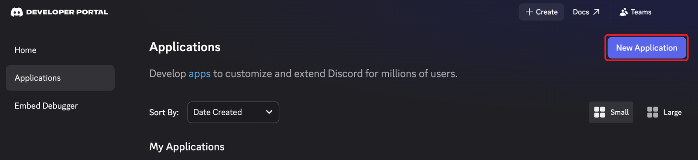

## 2. Name it and click Create

Give it a name (e.g. `my-codex`), tick the agreement box, and click **Create**.

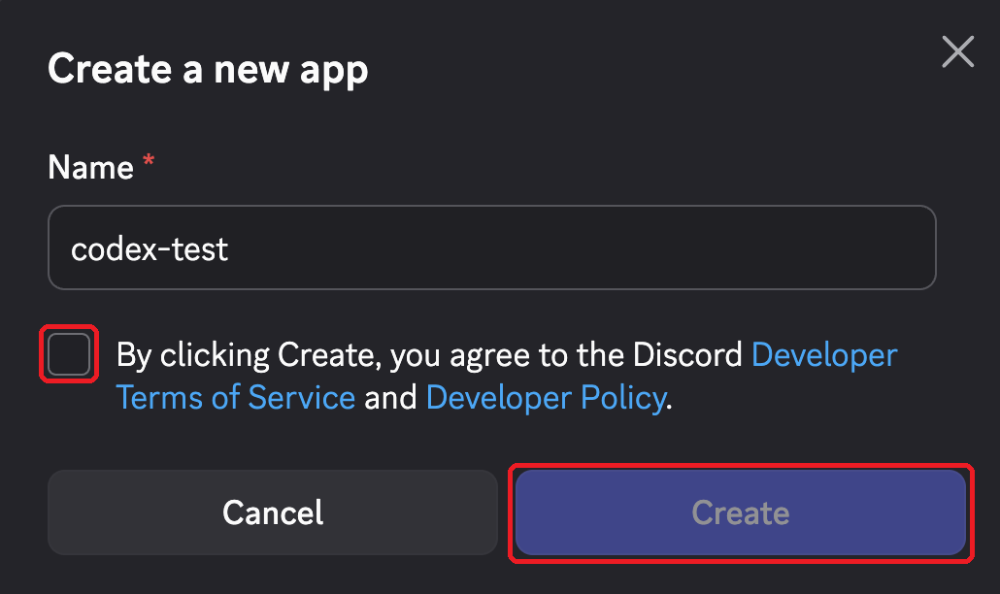

## 3. Solve the captcha

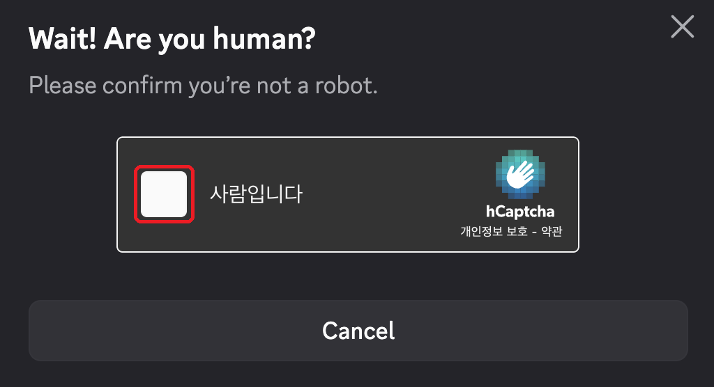

## 4. Open the Installation tab

You land on the app's settings page. Click **Installation** in the left sidebar.

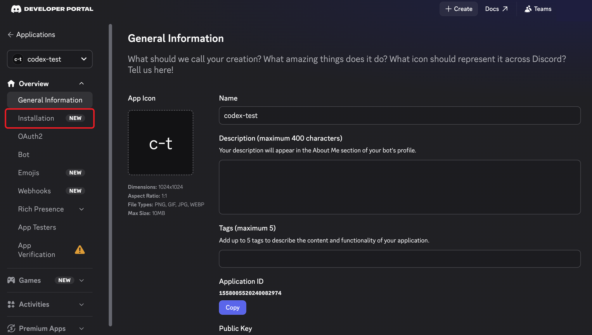

## 5. Set Install Link to "None"

Under **Install Link**, change the dropdown from *Discord Provided Link* to **None**, then click **Save Changes**. You need this before step 6 will let you turn off *Public Bot*.

Then click **Bot** in the left sidebar.

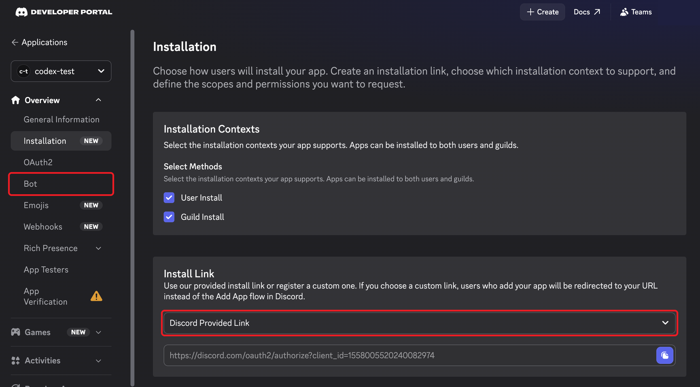

## 6. Turn off Public Bot

On the Bot page, scroll down and turn **Public Bot** off. Then only you can add this bot to a server.

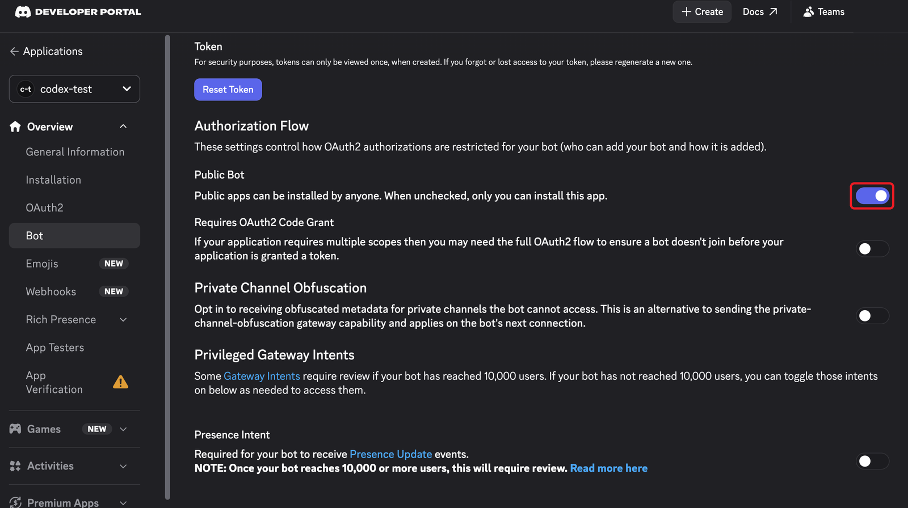

## 7. Turn on all three intents

Scroll to **Privileged Gateway Intents** and turn on all three: **Presence**, **Server Members** and **Message Content**. Without *Message Content Intent*, the bot sees every message as empty.

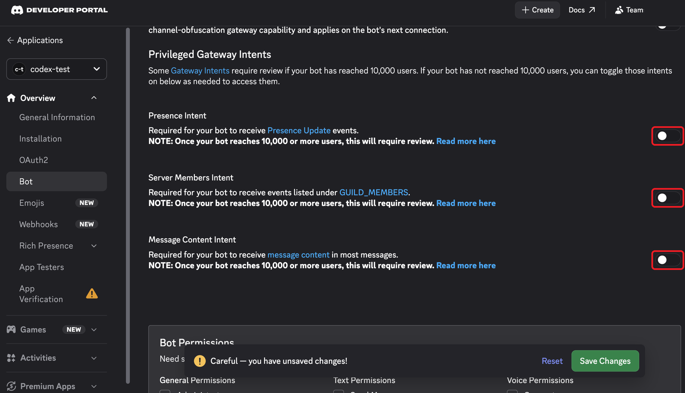

## 8. Tick Administrator and save

Scroll to **Bot Permissions**, tick **Administrator**, and click **Save Changes**. Then click **OAuth2** in the left sidebar.

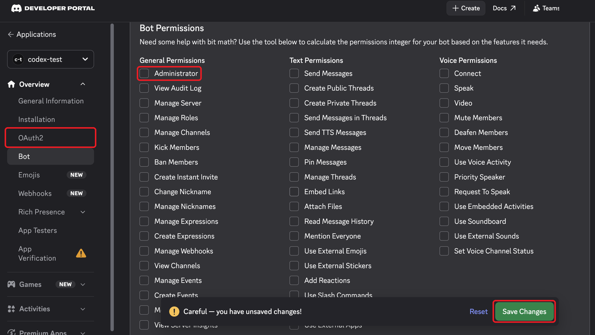

## 9. Scroll down on the OAuth2 page

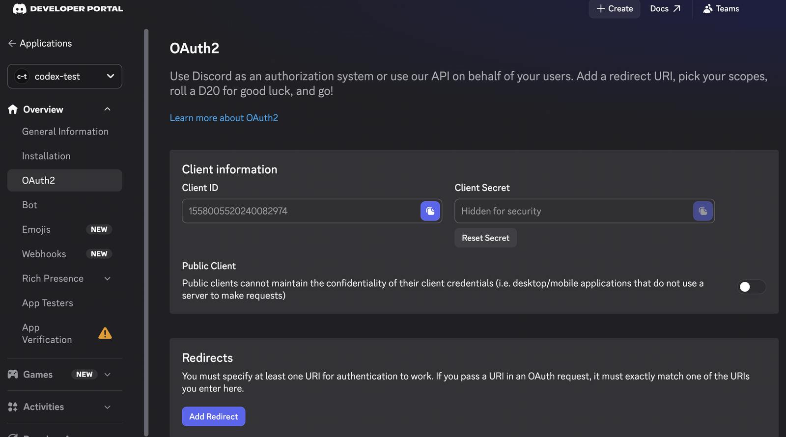

## 10. Tick the `bot` scope

Under **OAuth2 URL Generator → Scopes**, tick **bot**, then scroll down.

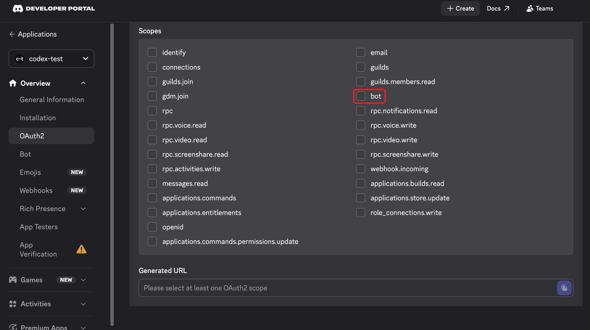

## 11. Tick Administrator again

Under **Bot Permissions** (on the OAuth2 page this time), tick **Administrator**, then scroll down.

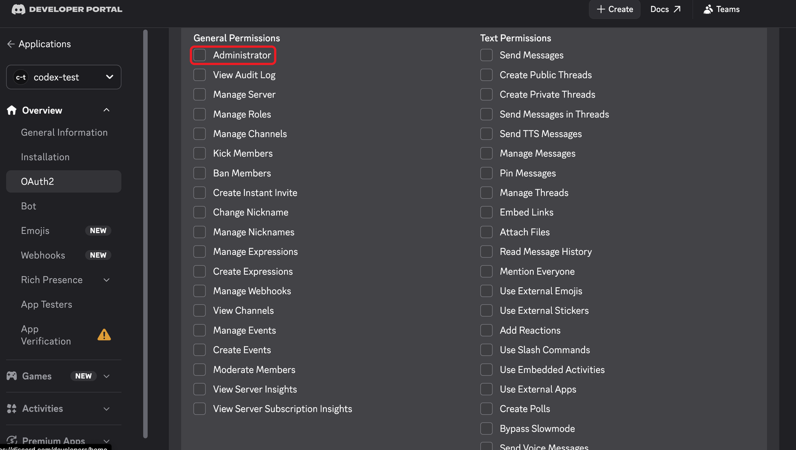

## 12. Copy the generated URL

Make sure **Integration Type** is **Guild Install**. Copy the **Generated URL** and open it in a new browser tab.

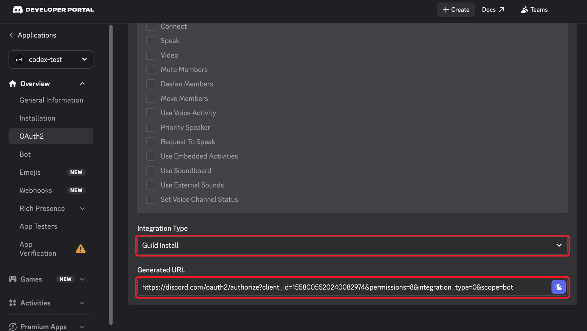

## 13. Choose your server

Pick your server under **Add to server** and click **Continue**.

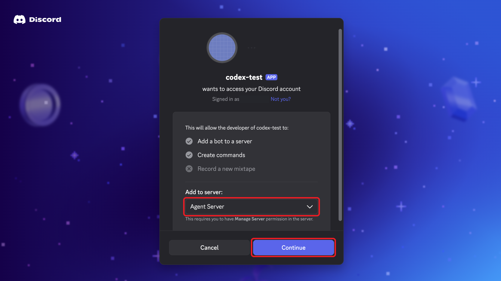

## 14. Authorize

Leave **Administrator** ticked and click **Authorize**.

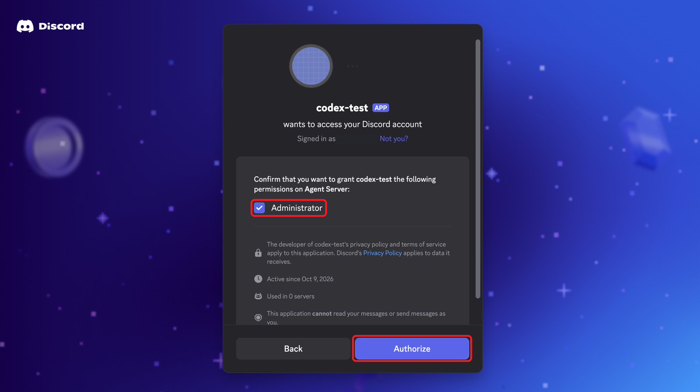

## 15. Solve the captcha

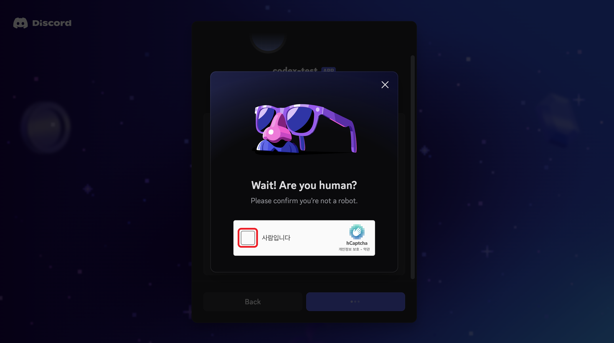

## 16. Done

The bot is now in your server. It shows as offline until you start the agent.

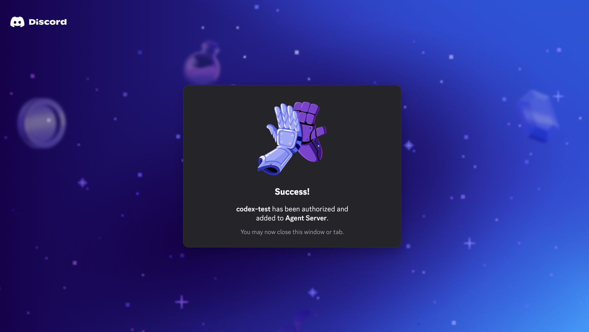

Next: [get the bot token](2_bot_token.md).
