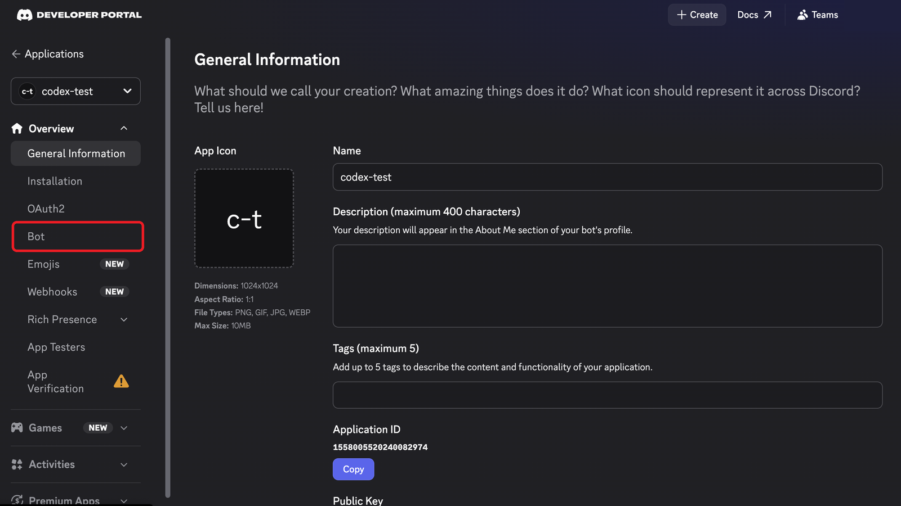
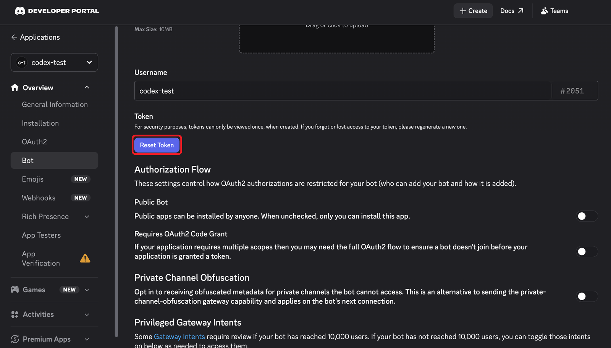
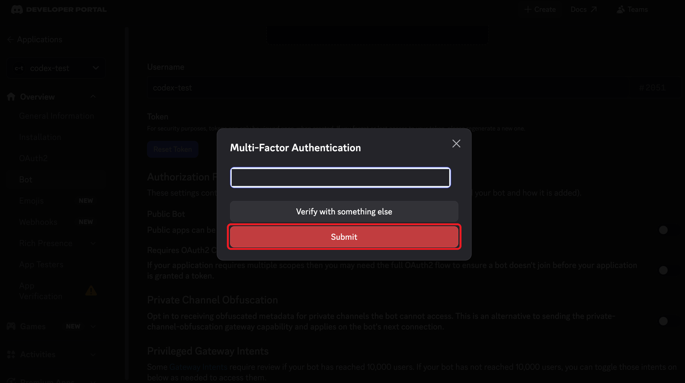
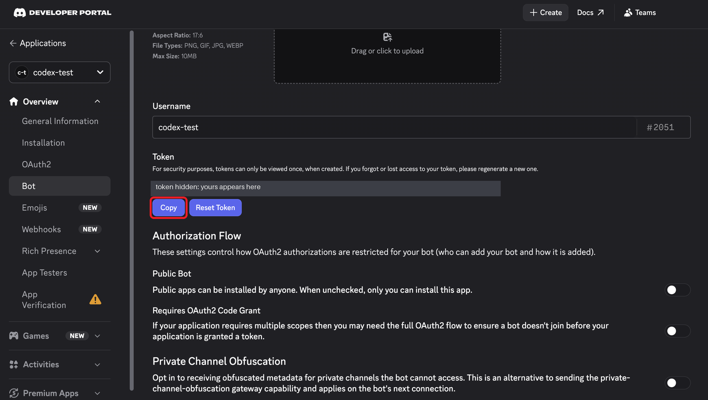

# Step 2: Get the bot token

The token is the bot's password: your agent uses it to log in as the bot. Discord shows it **only once**, right after you reset it.

## a. Open the Bot tab

In the [developer portal](https://discord.com/developers/applications), open your app and click **Bot** in the left sidebar.

## b. Click Reset Token

## c. Confirm

Discord asks whether you're sure. Click **Yes, do it!**

## d. Enter your password

Type your Discord password (or 2FA code) and click **Submit**.

## e. Copy the token

The token appears under **Token**. Click **Copy** and paste it somewhere safe right away, because you can't view it again. If you lose it, reset it again to get a new one.

> **Keep the token secret.** Anyone who has it controls your bot. Never paste it into a chat, a screenshot or a git commit. If it leaks, click **Reset Token**, and the old one stops working.

## Find your user ID

You'll also need your own Discord user ID, so the bot only takes orders from you.

1. In Discord, turn on **Developer Mode**: User Settings → Advanced → Developer Mode.
2. Right-click your name and choose **Copy User ID**. (Right-click a channel → **Copy Channel ID** works the same way.)

Next: connect [Claude Code](3_claude.md) or [Codex](4_codex.md).
